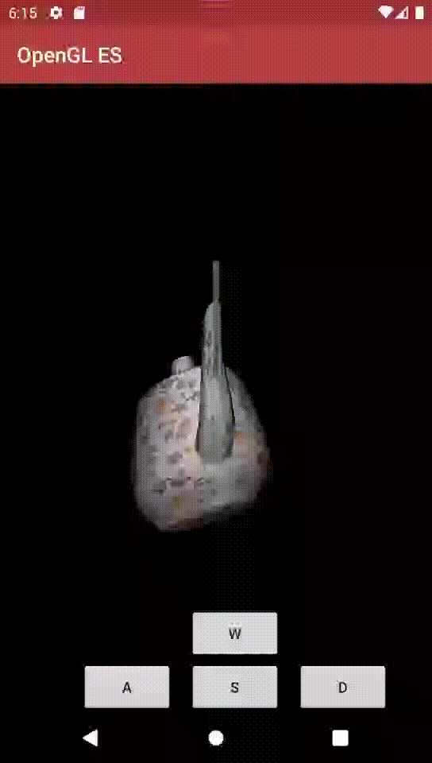

# COSE331 Computer Graphics @ Korea Univ.

## Implementation Results

<table>
  <tr>
    <td align="center">
       
      HW1: Teapot Rotation & Scaling
    </td>
    <td align="center">
       
      HW2: Running Animation with Normal Mapping & Forward Kinematics
    </td>
  </tr>
</table>

## HW1

### Objectives
- Compute `clip-space vertex positions` and `world-space vertex normals`
- `Transform` and `rotate` a teapot

### Relevant Files

| File Path | Description |
|-----------|-------------|
| `app/src/main/assets/vertex.glsl` | Problem 1: vertex position, vertex normal |
| `app/src/main/cpp/scene.cpp`      | Problem 2,3: scaling, rotating |

## HW2

### Objectives
- Implement `normal mapping` and `forward kinematics`
- Apply `skinning` on the mesh
- `Interpolate` the animation between key frames

### Relevant Files

| File Path | Description |
|-----------|-------------|
| `app/src/main/cpp/scene.cpp` | Scene class |
| `assets/vertex.glsl`     | Vertex shader |
| `assets/fragment.glsl`      | Fragment shader |

  
